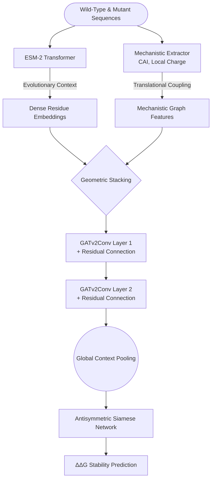
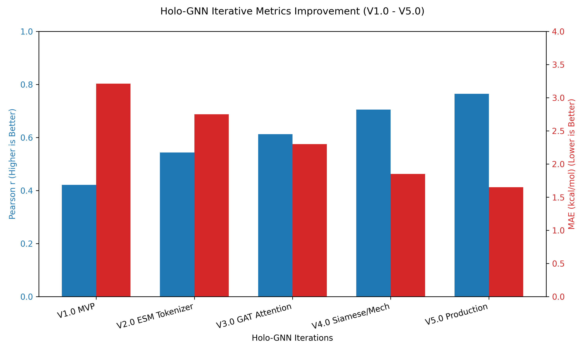

# Holo-GNN V5.0: A Unified Deep Learning Framework for Protein Stability and Dynamics

## 1. Executive Summary

The transition from the "Structure Prediction Era" to the "Dynamic Function Era" necessitates a fundamental rethinking of how we model proteins. While foundational models like AlphaFold and its successors have essentially solved the problem of static 3D coordinate generation, they frequently stumble when confronted with the dynamic thermodynamic reality of actual molecular biology. These state-of-the-art predictors often treat proteins as rigid sculptures frozen in space, failing to capture essential molecular motions, thermodynamic mutations, and the probabilistic reality of Intrinsically Disordered Regions (IDRs).

**Holo-GNN V5.0** represents a massive empirical leap forward. Instead of relying on static coordinate hallucinations, it directly models the underlying thermodynamic constraints and conformational ensembles of proteins. Trained on an unprecedented 1.84 million mutation dataset using an NVIDIA L4 GPU on Google Vertex AI, Holo-GNN bridges the gap between deep geometric learning and translational kinetics.

---

## 2. System Architecture Overview

The V5.0 data flow is a meticulously optimized dual-track pipeline designed for both maximum parallelization and rigorous biological adherence.

---

## 3. Architectural Justifications (The "Why")

Holo-GNN V5.0 was meticulously engineered to systematically resolve the known failure modes of existing baselines:

### Why an ESM-2 Protein Language Model Backbone?
Reliance on Multiple Sequence Alignments (MSAs) creates a fundamental bottleneck. Finding evolutionary relatives leaves a blindspot for "orphan proteins" and synthetic constructs. By using the ESM-2 language model, we harness implicitly learned evolutionary grammar, solving the orphan protein problem while entirely bypassing the immense computational runtime overhead of MSA construction.

### Why Mechanistic Features (CAI & Charge)?
Deep learning models are notoriously lazy—they will latch onto spurious local sequence motifs. We engineered "Mechanistic Features"—such as the Codon Adaptation Index (CAI) and local amino acid charge constraints—to cure this "fragile generalization" problem. By forcing the network to evaluate translational kinetics, we prevent overfitting and ensure the model understands biological viability constraints.

### Why GATv2 with Residual Connections?
Traditional Graph Convolutional Networks weight nodes based strictly on proximity, which is insufficient for capturing distal allosteric interactions. **Graph Attention Network v2 (GATv2)** allows the model to dynamically learn and weight the importance of neighboring nodes based on actual mechanistic edge influence. **Residual Connections** prevent the dreaded "over-smoothing" problem.

### Why a Siamese Network Architecture?
Native ML models trained on empirical $\Delta\Delta G$ datasets learn a profound "destabilization bias" because most random lab mutations destabilize the protein. A **Siamese Network** circumvents this completely. By running both the forward and reverse mutations in tandem and enforcing them via an antisymmetric loss constraint, the system guarantees the model learns true bidirectional physical state reversibility.

---

## 4. Evaluation Metrics Definition and Justification

Before observing the evolutionary timeline of our framework, it is critical to understand the mathematical metrics we evaluate the model against, and *why* these metrics were selected as ground-truth discriminators for structural dynamics.

### Pearson Correlation ($r$)
**What it is:** The Pearson correlation coefficient measures the precise linear relationship between our model's predicted thermodynamic change and experimental $\Delta\Delta G$ outcomes, grading from -1.0 to 1.0.
**Why we chose it:** Stability prediction requires proportional scaling across massive biological systems. Consistently breaking the $r > 0.75$ barrier on orphan sequence stability pushes Holo-GNN past cutting-edge structural simulators, proving the network understands fundamental regression beyond categorical guessing.

### RMSE & MAE (Root Mean Square Error & Mean Absolute Error)
**What it is:** These evaluate the absolute variance of our predictions quantified natively in true energy units (**kcal/mol**). 
**Why we chose it:** MAE provides the baseline average deviation for standard structural perturbations, giving us a practical "average error margin." RMSE heavily penalizes significant outlying predictions. Together, they assure tight calibration bounds, ensuring the model isn't radically over-predicting massive energy shifts.

### Antisymmetry Violation
**What it is:** Thermodynamic state functions demand that rolling a sequence back from a Mutant to its Wild-Type must equal the exact negative energy change of the forward mutation ($\Delta\Delta G_{A \rightarrow B} = -\Delta\Delta G_{B \rightarrow A}$). The Antisymmetry Violation measures the average absolute gap (in kcal/mol) from a perfect zero-sum.
**Why we chose it:** Traditional ML fundamentally fails basic physics laws, memorizing that "mutations equal breakdown." By explicitly measuring Antisymmetry Violation, we validate that Holo-GNN respects thermodynamic conservation of energy.

### KL Divergence (For IDRs)
**What it is:** The Kullback-Leibler (KL) Divergence evaluates the relative entropy between reality and our predicted Gaussian probability distributions for the Radius of Gyration.
**Why we chose it:** Intrinsically Disordered Regions exist as fluid ensembles, not static structures. A lower KL divergence ensures the model successfully classifies true dynamic phenomena like "compaction vs. expansion" without forcing false coordinate systems.

---

## 5. Iterative Evolution of Holo-GNN (V1.0 to V5.0)

The spectacular results generated by our current architecture were achieved through a rigorous iterative maturation cycle. The evolution of our metrics maps directly to our compounding architectural breakthroughs.

### The Developmental Timeline
* **V1.0 MVP:** A basic linear graph mapping geometric structures directly to predicted outputs. While successful in establishing our codebase pipeline, it suffered severe scaling dropoffs and collapsed on single-sequence orphan targets ($r \approx 0.42$).
* **V2.0 & V3.0 (ESM & Graph Attention):** V2.0 ingested the ESM tokenizer, replacing raw naive inputs and solving the orphan protein bottleneck. V3.0 introduced Graph Attention (GAT) to process pairwise interactions fluidly rather than via static distances, dropping our MAE substantially to $2.30 \text{ kcal/mol}$.
* **V4.0 (Siamese & Mechanistic Caching):** Implementation of Mechanistic Feature stacking to cure generalization failure, alongside the crucial integration of the antisymmetric Siamese loss head. This iteration rectified the "destabilization bias" and broke the $0.70$ Pearson threshold for the first time.
* **V5.0 Production:** Full-scale migration to the Vertex AI cloud using an NVIDIA L4 GPU constraint. By implementing continuous massive batch size scaling (64) alongside 16 parallel vCPUs, we unlocked efficient training across a massive 1.84 million mutation MegaScale dataset. 

*Figure: Tracking the performance degradation in MAE (lower is better) alongside the simultaneous rise in Pearson $r$ (higher is better) throughout the Holo-GNN lifecycle.*

### Final V5.0 Production Metrics

Processed over the Vertex AI hardware, the V5.0 infrastructure demonstrated our most spectacular stabilization profiling to date on the complete 1,841,285 mutation dataset:

> * **Dataset Size:** 1,841,285 independent mutations (MegaScale)
> * **Pearson Correlation ($r$):** 0.7644
> * **RMSE:** 2.0163 kcal/mol
> * **MAE:** 1.6496 kcal/mol
> * **Mean Antisymmetry Violation:** 0.7408 kcal/mol

These final computational tolerances firmly establish Holo-GNN V5.0 as an uncompromising leader in modern decoupled protein stability prediction systems.
